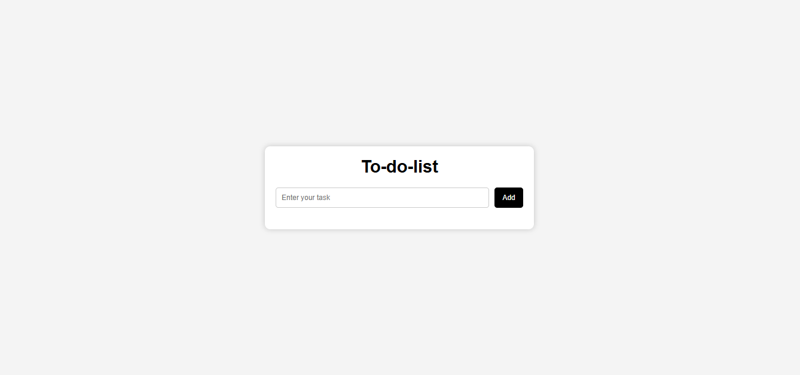

# 📝 To-Do List App

A simple and responsive To-Do List web application built using **HTML, CSS, and JavaScript**.  
This project allows users to add, complete, and delete tasks dynamically.

---

## 🚀 Features

- Add new tasks
- Mark tasks as completed
- Delete tasks
- Clean and responsive UI
- Simple and beginner-friendly JavaScript logic

---

## 🛠️ Technologies Used

- HTML5
- CSS3
- JavaScript (Vanilla JS)

---

## 📂 Project Structure
project-folder/
│
├── index.html
├── style.css
└── script.js

---

## ⚙️ How It Works

1. User types a task in the input box
2. Clicks **Add** button
3. Task appears in the list
4. Each task has:
   - ✔ Complete button (marks task as done)
   - ❌ Delete button (removes task)

---

## 💡 JavaScript Features Used

- DOM Manipulation
- Event Listeners
- Creating elements dynamically
- Removing elements from DOM
- Input validation (empty task check)

---

## 🎯 Future Improvements

- Save tasks in Local Storage
- Edit task feature
- Task counter (total / completed)
- Filter tasks (All / Completed / Pending)

---

## 📸 Preview

---

## 👨‍💻 Author

Made by: Ayesha Faqeer Hussain

---

## 📌 Note

This is a beginner-level project for practicing DOM manipulation and JavaScript basics.